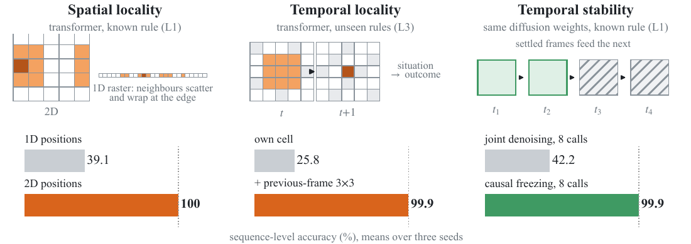
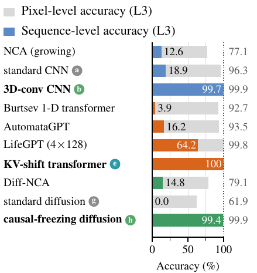

# Why Do Conventional World Models Fail to Learn Cellular Automata?

Reproduction codebase and project page. Scored per pixel, conventional world models look nearly solved; scored per exact rollout, they fail. This repository provides code and selected reproduction materials for the three failure modes — spatial locality, temporal locality, and temporal stability — and the changes evaluated in the paper. The coverage table below states which results can be retrained, directly re-evaluated, or inspected as records.

  
  
  

## Main figures and conclusions

**Three failures of standard next-frame models, and the change that repairs each** (exact rollouts, %):

- **Spatial locality** — flattening the grid into one token sequence hides which cells are neighbours: 1-D rotary positions **39.1%** → 2-D positions **100%** on the Game of Life, parameters unchanged.
- **Temporal locality** — a situation and its outcome lie one frame apart and standard models rarely bind them: standard transformer **25.8%** → previous-frame 3×3 neighbourhood on each token **99.9%** on unseen rules.
- **Temporal stability** — joint denoising never settles a frame before later ones use it: causal freezing, same weights, **42.2%** → **99.9%**.

Per-pixel accuracy hides rule errors: a CNN predicts **96.3%** of cells yet completes only **18.9%** of rollouts, and a joint diffusion model completes none. None of the three repairs touches the architectural backbone; each only changes the information flow within it. SeqAcc numbers are means over registered seeds on the fixed self-consistent corpora; per-seed values and full protocols are in the paper and under `results/data/`.

Further figures (information flow, induction pairing, sampling comparison, design space) are in the [result gallery](results/RESULTS.html).

## Reproduction materials

The fixed release is [`release-2026-10-04`](https://github.com/guoshaoyang-pku/momentum-induction/tree/release-2026-10-04). It contains selected materials rather than all paper checkpoints and run logs.

| Coverage | Released materials | What can be checked |
|---|---|---|
| Retraining | CA simulator, model implementations, training/evaluation entry points, and pinned evaluation corpora | Train the released CA models using the protocol and recipes in the paper; new training runs do not recover the original run logs. |
| Direct checkpoint re-evaluation | Six E21 EMA checkpoints (two four-read attention models, seeds 42/43/44), selection table, and `scripts/reproduce_e21.py` | Re-evaluate the selected L4B scores without retraining. |
| Result records | Selected per-seed CSV/JSON tables in `results/data/`, including the E11 sampler comparison, LifeGPT, E21 and E22, plus figure files | Inspect recorded values and verify the shipped hashes and table consistency. Checkpoints for E11 and the other paper runs are not bundled. |
| Not included | Complete original run logs, raw predictions and checkpoints, and continuous-dynamics experiment code | The Burgers, advection–diffusion and continuous-particle experiments cannot be rerun from this release. |

Everything listed below lives in this release tree:

- **Code** — single entry point `PYTHONPATH=scripts python3 -m cawm.train --help`; full test suite `PYTHONPATH=scripts python3 -m pytest scripts/tests` (228 tests).
- **Paper** — `paper/`: MetaCircle-branded PDF (`paper/main.pdf`) and LaTeX source (`paper/main.tex`).
- **Gallery and tables** — `results/RESULTS.html` (figures with PNG/PDF); plotted-value tables in `results/data/`; figure files in `results/figures/`.
- **Checkpoints** — `weights/`: six E21 EMA checkpoints; re-evaluate on the strict L4B corpus with `python3 scripts/reproduce_e21.py --device cpu --batch 64`.
- **Evaluation corpora** — `data/eval_corpora/`: checksum-verified `.npz` with SHA-256 `.json` sidecars (post-submission regenerated, seed=42 hash-split).
- **Integrity** — `python3 scripts/release_manifest.py --check` verifies every shipped file and sidecar hash; `python3 scripts/verify_results.py` gives a dependency-free check of summaries, weights, and figure hashes.
- **Environment** — Python 3.10–3.13; `requirements.txt` pins NumPy/PyTorch/pytest. Install with `python3 -m venv .venv && . .venv/bin/activate && python -m pip install -r requirements.txt`.

Released under the MIT License; see [LICENSE](LICENSE).
